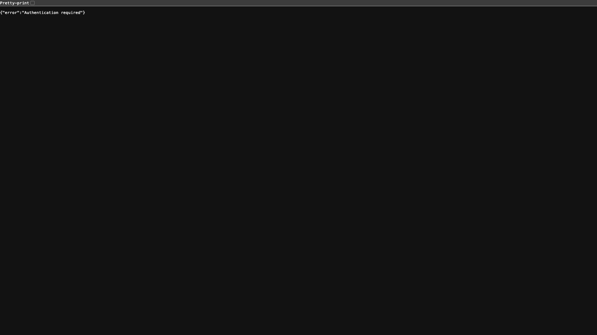
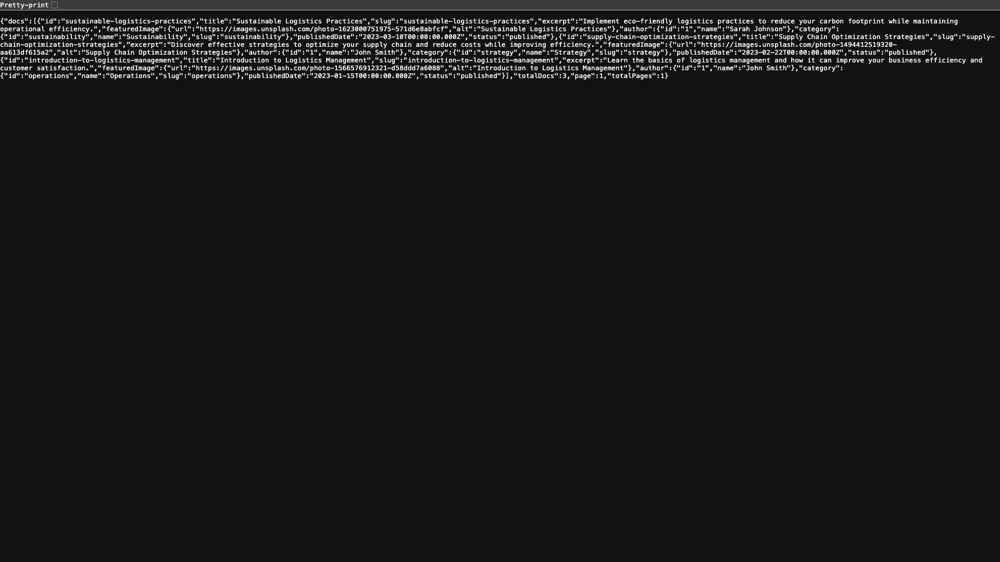
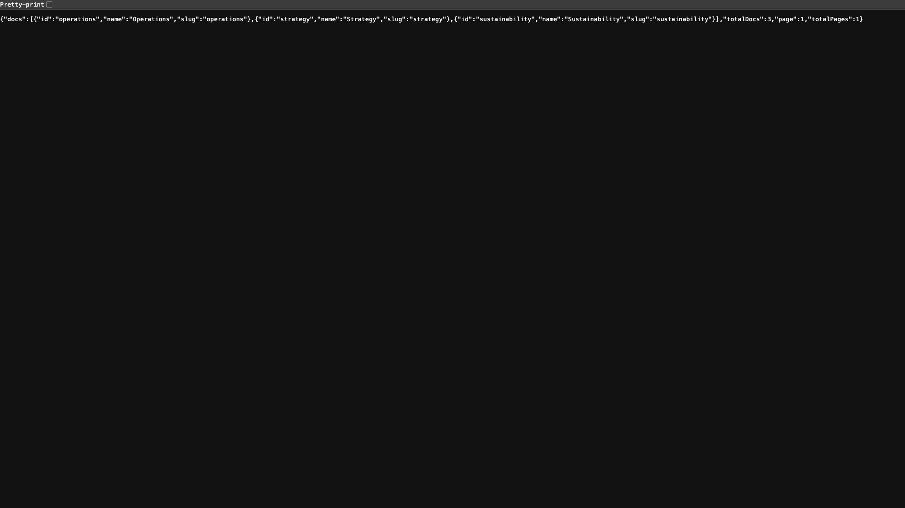
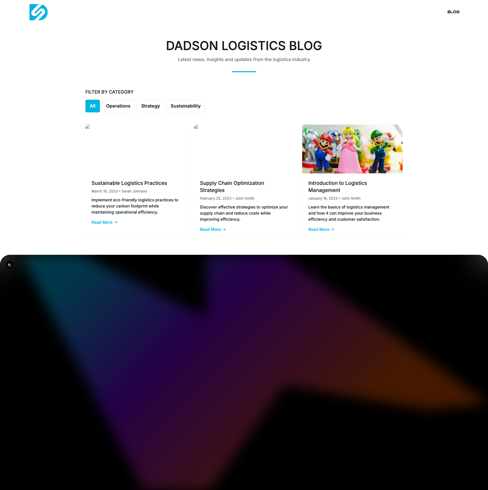
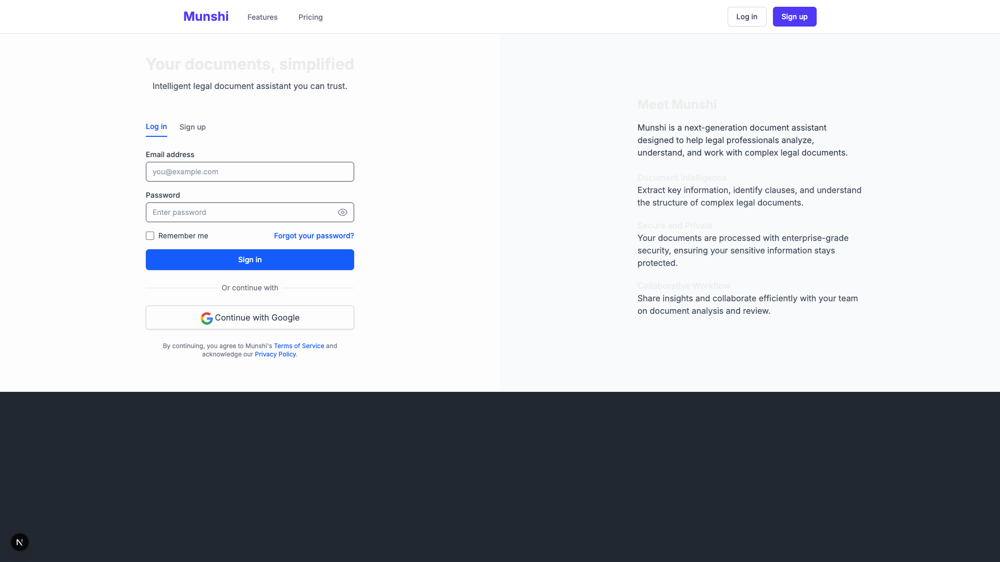

# Blog Module Debugging Log


## Blog Module Debugging Process

Starting debugging process at 2025-06-16T12:51:45.150Z

## 1. Initial Port Verification

Running command: `lsof -i :3000`
Command output:
```
COMMAND   PID         USER   FD   TYPE             DEVICE SIZE/OFF NODE NAME
node    16661 kashishkumar   16u  IPv6 0x9d92f169450b2f74      0t0  TCP *:hbci (LISTEN)

```
Running command: `lsof -i :3001`
Command output:
```
COMMAND   PID         USER   FD   TYPE             DEVICE SIZE/OFF NODE NAME
node    17235 kashishkumar   16u  IPv6 0xbc467ca650f9ea25      0t0  TCP *:redwood-broker (LISTEN)

```

## 2. MongoDB and PayloadCMS Verification

Running command: `brew services list | grep mongodb`
Command output:
```
mongodb-community started         kashishkumar ~/Library/LaunchAgents/homebrew.mxcl.mongodb-community.plist

```

## 3. API Connection Testing

PayloadCMS Articles API test



API Response:
```json
{"error":"Authentication required"}...
```
Next.js Blog API test



API Response:
```json
{"docs":[{"id":"sustainable-logistics-practices","title":"Sustainable Logistics Practices","slug":"sustainable-logistics-practices","excerpt":"Implement eco-friendly logistics practices to reduce your carbon footprint while maintaining operational efficiency.","featuredImage":{"url":"https://images.unsplash.com/photo-1623000751975-571d6e8abfcf","alt":"Sustainable Logistics Practices"},"author":{"id":"1","name":"Sarah Johnson"},"category":{"id":"sustainability","name":"Sustainability","slug":"sus...
```
PayloadCMS Categories API test


Next.js Blog Categories API test




## 4. Frontend Visual Testing

Next.js Blog Page



Network Requests:
```json
[]
```
PayloadCMS Admin Page




## 5. Environment Variables Check

Next.js Environment Variables:
```
NEXT_PUBLIC_PAYLOAD_URL=http://localhost:3001
MONGODB_URI=mongodb://localhost:27017/dadson-blog
PAYLOAD_SECRET=dadson-blog-secret-key-change-me-in-production 
```
PayloadCMS Environment Variables:
```
MONGODB_URI=mongodb://localhost:27017/dadson-blog
PAYLOAD_SECRET=dadson-blog-secret-key-change-me-in-production
PAYLOAD_PORT=3001
PAYLOAD_PUBLIC_SERVER_URL=http://localhost:3001
NEXT_PUBLIC_PAYLOAD_URL=http://localhost:3001 
```

## 6. Debugging Summary

### Observed Issues:
*Automatically identify issues based on debug results here*
1. *Fill in once identified*
### Recommendations:
1. *Fill in once identified*
The debugging process is complete. Check the debug-blog-results directory for screenshots and logs.
